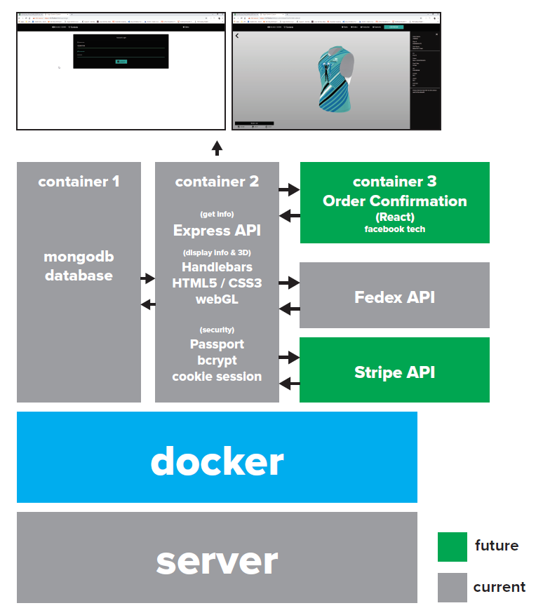
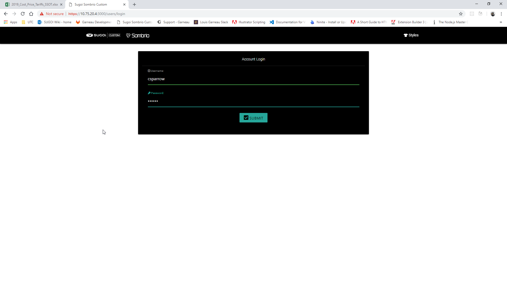
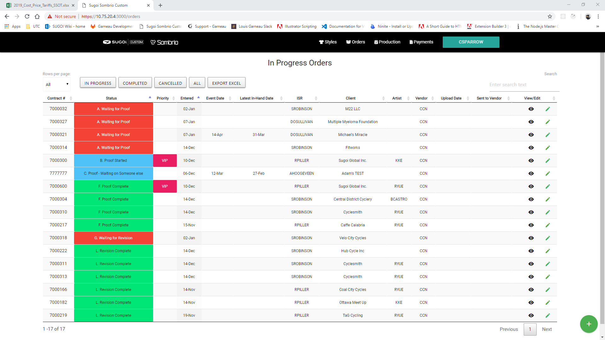
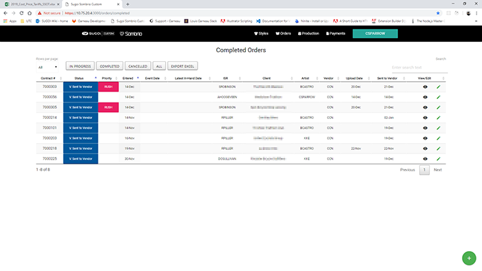
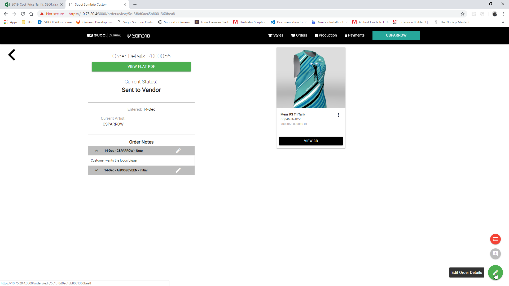
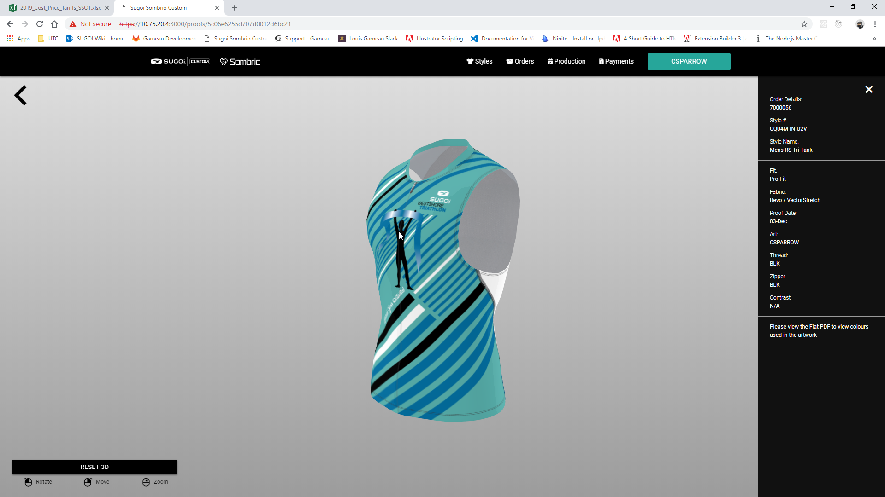
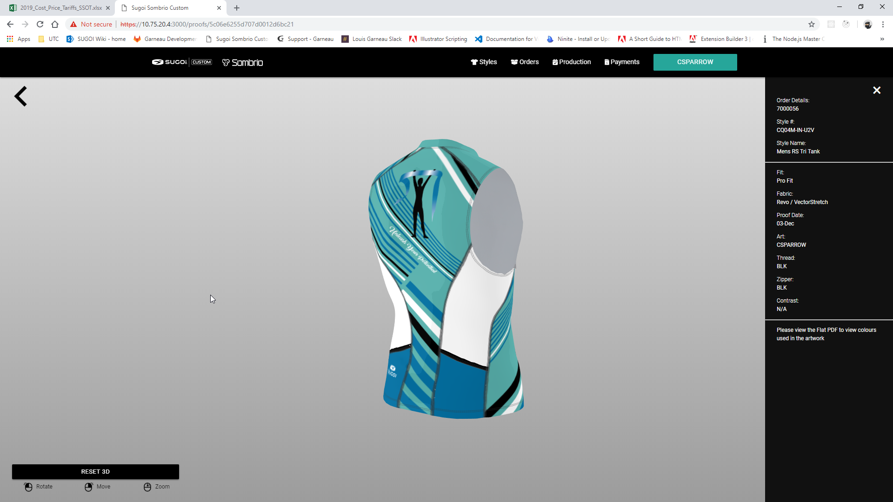
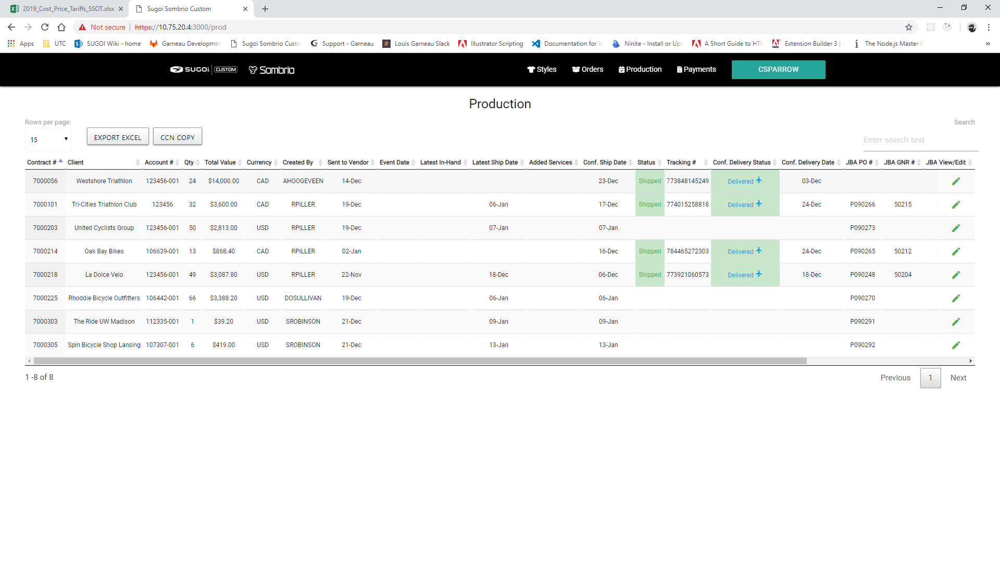
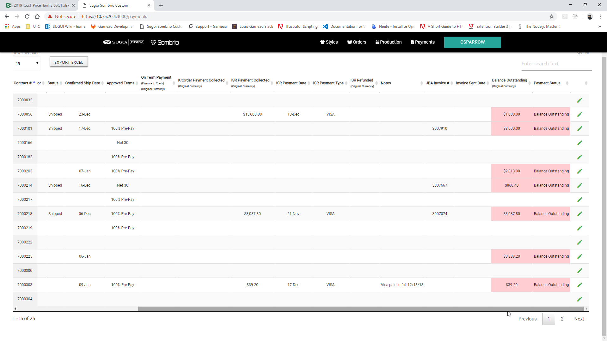
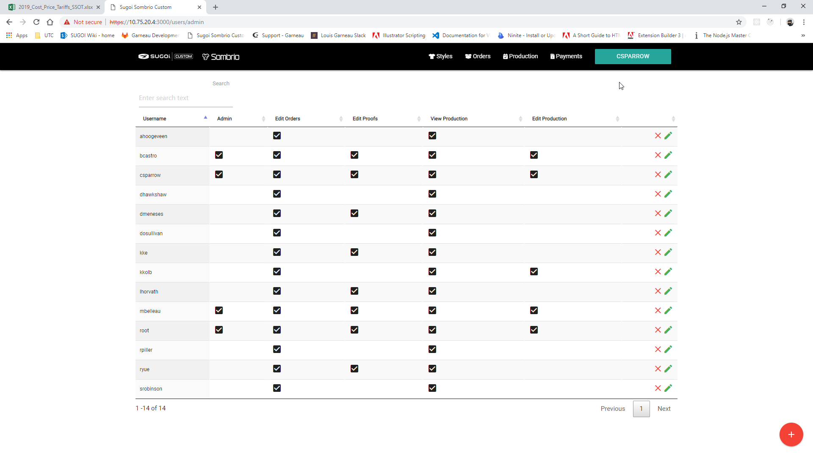

# Sugoi Custom Portal

Full Stack Node.js / MongoDB application to keep track of custom orders and act as front-end portal for customer to view custom orders.

## Description

The Sugoi portal is a fully secured application that allows the Sugoi custom team to enter, edit and keep track of custom orders. The Art department will also use it to keep track of incoming orders to be worked on. Full visibility of orders and allowing customers to view their proofs in 3D are the main focus.

The login screen which uses passport and express to authenticate users stored in the database, once authenticated, a session is created for the user and is logged into the main dashboard.

Shows all orders in progress

Shows all orders that are completed

Can go into any order to view the result of the art teams work on the order if available

3D of the garment

Another view of the garment

Once order is completed all production information can be seen here, shipping, delivery date etc...

This is where sales team enters any payments they have taken (soon to be connectd to Stripe API)

Admin section to govern users
